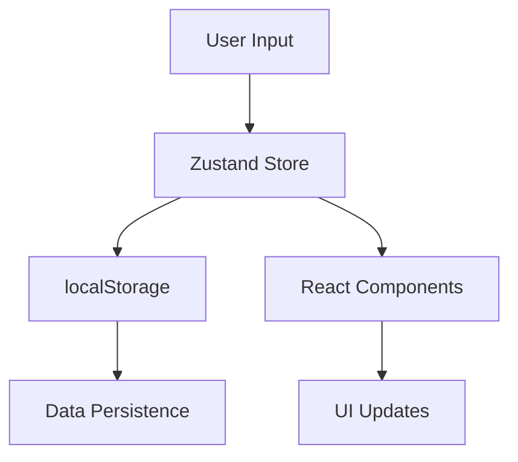

# RISA - Vaksin HPV Booking Platform

🌐 **Live Demo**: [risa-vaksinhpv.netlify.app](https://risa-vaksinhpv.netlify.app)

## 📋 Overview

RISA adalah platform web untuk booking vaksinasi HPV yang memungkinkan pengguna menemukan laboratorium Prodia terdekat, memilih paket vaksin, dan melakukan booking dengan mudah. Platform ini dibangun dengan Next.js dan menggunakan teknologi modern untuk memberikan pengalaman pengguna yang optimal.

## 🚀 Tech Stack

- **Framework**: Next.js 14 (App Router)
- **Styling**: Tailwind CSS
- **State Management**: Zustand
- **Maps**: React Leaflet + OpenStreetMap
- **Icons**: Emoji & Custom Icons
- **Storage**: localStorage (client-side)
- **Deployment**: Netlify

## 📁 Project Structure

```
vaksin-hpv/
├── app/
│   ├── components/
│   │   ├── maps/
│   │   │   ├── Map.js              # Main map component
│   │   │   ├── MapComponent.js     # Map wrapper
│   │   │   ├── NearestLabs.js      # Nearest labs markers
│   │   │   ├── LabsMarker.js       # All labs markers
│   │   │   └── UserMarker.js       # User location marker
│   │   ├── BookingModal.js         # Booking form modal
│   │   ├── VaccineInfoModal.js     # Vaccine information modal
│   │   ├── ETicket.js              # E-ticket component
│   │   ├── FAQ.js                  # FAQ accordion
│   │   ├── PromoCarousel.js        # Promo carousel
│   │   └── Toast.js                # Location permission toast
│   ├── store/
│   │   ├── useBookingData.js       # Booking data state
│   │   ├── useModalState.js        # Modal states management
│   │   ├── useVaccineTypes.js      # Vaccine types data
│   │   ├── useLabsLocation.js      # Labs location data
│   │   ├── useUserLocation.js      # User location state
│   │   ├── useNearestLabs.js       # Nearest labs state
│   │   ├── useLocationToast.js     # Toast state
│   │   └── useLocationPermission.js # Location permission state
│   ├── globals.css                 # Global styles
│   ├── layout.js                   # Root layout
│   └── page.js                     # Main page
├── public/                         # Static assets
└── README.md                       # Documentation
```

## 🎯 Key Features

### 1. **Interactive Map Integration**
- Real-time location detection
- Nearest labs calculation
- Interactive markers with lab details
- Google Maps integration for directions

### 2. **Smart Booking Flow**
```
User Journey:
1. Select vaccine package → 2. View vaccine info → 3. Fill booking form → 4. Get e-ticket
```

### 3. **Responsive Design**
- Mobile-first approach
- Optimized for all screen sizes
- Touch-friendly interactions

### 4. **State Management**
- Centralized state with Zustand
- Persistent data with localStorage
- Efficient re-renders

## 🔧 Installation & Setup

```bash
# Clone repository
git clone <repository-url>
cd vaksin-hpv

# Install dependencies
npm install

# Run development server
npm run dev

# Build for production
npm run build

# Start production server
npm start
```

## 🌐 Deployment Guide

### Netlify Deployment

1. **Connect Repository**
   ```bash
   # Push to GitHub/GitLab
   git add .
   git commit -m "Initial commit"
   git push origin main
   ```

2. **Netlify Configuration**
   - Build command: `npm run build`
   - Publish directory: `.next`
   - Node version: 18.x

3. **Environment Variables** (if needed)
   ```
   NEXT_PUBLIC_API_URL=your_api_url
   ```

### Custom Domain Setup
```
# Add custom domain in Netlify dashboard
Domain: risa-vaksinhpv.netlify.app
SSL: Auto-enabled
```

## 📊 Data Flow Architecture



## 🎨 Design System

### Color Palette
```css
Primary Pink: #F89BB1 (theme-color)
Secondary Purple: #A855F7
Background: #FDF2F8 to #FFFFFF
Text: #382B22
Success: #10B981
Warning: #F59E0B
```

### Typography
- Font Family: Inter (Google Fonts)
- Responsive scaling: text-sm → text-base → text-lg

## 🔐 Security Considerations

1. **Client-Side Storage**
   - Sensitive data stored in localStorage only
   - No server-side data persistence
   - Data cleared on booking reset

2. **Input Validation**
   - Form validation with HTML5 patterns
   - NIK: 16 digits validation
   - Phone: 10-13 digits validation

## 📱 Mobile Optimization

### Performance
- Lazy loading for components
- Optimized images with Next.js Image
- Minimal bundle size with tree shaking

### UX Enhancements
- Touch-friendly buttons (44px minimum)
- Swipe gestures for carousel
- Responsive typography
- Optimized map height for mobile

## 🧪 Testing Strategy

### Manual Testing Checklist
- [ ] Location permission flow
- [ ] Map interaction and markers
- [ ] Booking form validation
- [ ] E-ticket generation
- [ ] Mobile responsiveness
- [ ] Cross-browser compatibility

### Browser Support
- Chrome 90+
- Firefox 88+
- Safari 14+
- Edge 90+

## 🚀 Performance Metrics

### Target Metrics
- First Contentful Paint: < 1.5s
- Largest Contentful Paint: < 2.5s
- Cumulative Layout Shift: < 0.1
- First Input Delay: < 100ms

### Optimization Techniques
- Next.js automatic code splitting
- Image optimization
- CSS-in-JS with Tailwind
- Minimal JavaScript bundle

## 🔄 Future Enhancements

### Phase 2 Features
- [ ] User authentication
- [ ] Booking history
- [ ] Push notifications
- [ ] Payment integration
- [ ] Admin dashboard

### Technical Improvements
- [ ] PWA implementation
- [ ] Offline functionality
- [ ] Real-time booking updates
- [ ] Analytics integration

## 🐛 Troubleshooting

### Common Issues

1. **Map not loading**
   ```bash
   # Check Leaflet CSS import
   import 'leaflet/dist/leaflet.css';
   ```

2. **Location permission denied**
   - Ensure HTTPS in production
   - Handle permission gracefully

3. **Build errors**
   ```bash
   # Clear Next.js cache
   rm -rf .next
   npm run build
   ```

## 📞 Support & Maintenance

### Monitoring
- Netlify Analytics for traffic
- Browser console for errors
- User feedback collection

### Updates
- Regular dependency updates
- Security patches
- Feature enhancements based on user feedback

## 📄 License

This project is proprietary software developed for RISA platform.

---

**Developed by**: IT Professional Team  
**Last Updated**: September 2025  
**Version**: 1.0.0